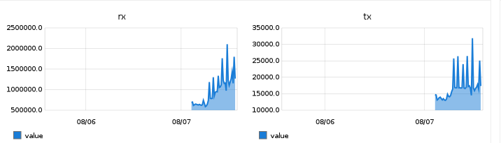

***********
**ethMon**
***********

ethMon is an Icinga2/Nagios compatible Python plugin for network traffic monitoring on a specific interface.
Currently the carbon/graphite data is always in *bytes*.

Graph drawn from a collected data

In order to calculate the speed the plugin keeps the data from previous runs in ~/.ethMonCache.db

**Installation**
=================
* Download ethMon to the Icinga/Nagios plugin directory (`/usr/lib/nagios/plugins/` on Debian 10)
* Ensure that the executable bit of *ethMon* is set

**Configuration**
=================

* In order to use the plugin with Icinga the following configuration is needed:
    * in */usr/share/icinga2/include/command-plugins.conf* add the following

        .. code-block:: console

            template CheckCommand "ethMon-common" {
                command = [ PluginDir + "/ethMon" ]
                arguments = {
                        "-i" = {
                            value = "$interface$"
                            description = "Interface which will be monitored"
                        }
                        "-w" = {
                            value = "$speed_warn$"
                            description = "Warning threshold"
                        }
                        "-c" = {
                            value = "$speed_crit$"
                            description = "Critical threshold"
                        }
                        "-s" = {
                            value = "$speed_scale$"
                            description = "Speed scaling"
                        }
                        "--interval" = {
                            value = "$chk_interval$"
                            description = "Interval between the checks (in seconds)"
                        }
                }
                vars.speed_warn = 60
                vars.speed_crit = 100
                vars.speed_scale = "Mb"
                vars.chk_interval = 30
            }
            object CheckCommand "ethMon" {
                import "ethMon-common"
            }
        ..

    * then per host (or zone if the interface name match everywhere):

        .. code-block:: console

            apply Service "Traffic-enp3s5" {
                check_command = "ethMon"
                check_interval = 30
                vars.interface = "enp3s5"
            command_endpoint = host.vars.client_endpoint // Check executed on client node
            assign where host.vars.client_endpoint == "TheMonitoredHost" // The service is applied only to this node
            }
        ..

    * **NOTE**: The same value must be used for *check_interval & vars.chk_interval*

**Motivation**
================

The plugin has been created as *check_eth* from Nagios Exchange refused to work in my current setup.
